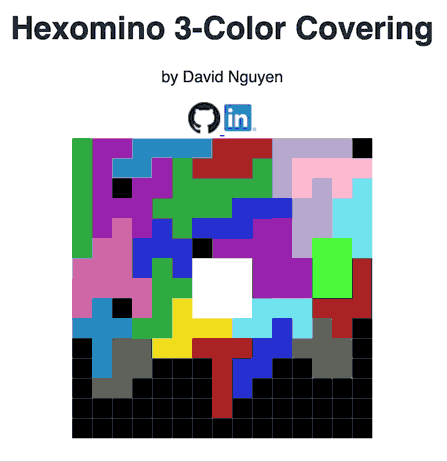

# Hexomino 3-Color Covering

## Class Number
California State University Fullerton 
CPSC 335-02 
Algorithm Engineering

## Project Number and Name
No.: 3 
Name: Hexomino 3-Color Covering 

## Team Name and Members
Team Name: HexoSolo 
Members:
* David Nguyen

## Intro
The purpose of this project is to demonstrate Hexominoes filling a 15x15 grid with a 3x3 center cutout.

## Contents
img/GitHub-Mark-32px.png - GitHub Logo 
img/LinkedIn-Bug-32px.png - LinkedIn Logo 
img/HexoDemo.gif - Sorting Algorithm Race Preview 
static/css/styles.css - Stylesheet 
static/js/cs-sketch.js - Renders Sorting Algorithm Race 
static/js/draw_stuff.js - Draws a grid 
static/js/p5.js - p5.js library for drawing 
static/js/matrices.js - hexomino dictionary 
index.html - index page that holds the hexomino demo 
README.md - What you're currently reading. 
README.txt - Plain ASCII of what you're currently reading. 

## External Requirements
Please use a browser with ES6 capabilities.
| Browser | Minimum Version |
|---------|-----------------|
| Chrome  | 51              |
| Firefox | 54              |
| Edge    | 14              |
| Safari  | 10              |
| Opera   | 38              |

## Setup and Installation
Run index.html on a local server or open in browser. 
You may also visit https://www.knytes.com/Hexomino-3-Color-Covering/

## Sample Invocation

## Features
 - Press any button to resume/pause
 - ***(Missing)*** A perfect hexomino cover.
 - ***(Missing)*** A 3 color cover.

## Bugs
None reported.

## Contact
David Nguyen - david@knytes.com
